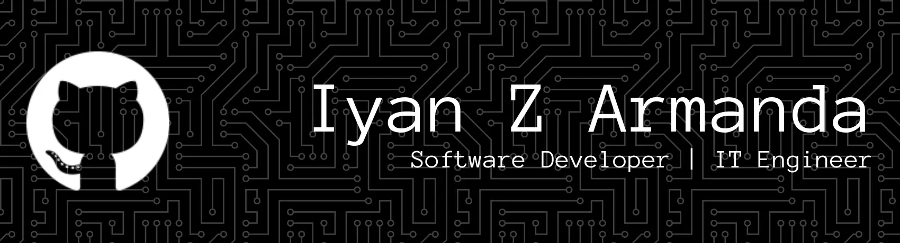

---

## Sub Repositories

- [**unesa-iyan165**](https://github.com/unesa-iyan165) – my documentation task in Universitas Negeri Surabaya as informatic engineering bachelor.
- [**iyanarmanda-lab1**](https://github.com/iyanarmanda-lab1) – focused on experiment technologies, or unique apps.
- [**iyanarmanda-archive**](https://github.com/iyanarmanda-archive) – archived projects or prototypes.
- [**iyanarmanda-learn**](https://github.com/iyanarmanda-learn) - my course or project to learn some programming or tools.

## Tech Stacks

  

### Soon

---

  

