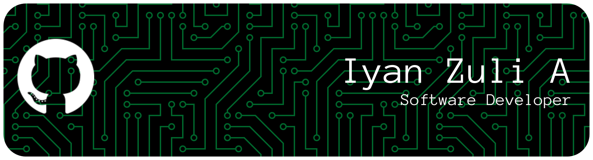

---

## Sub Repositories

- [**Universitas Negeri Surabaya**](https://github.com/unesa-iyan165) – my documentation task in Universitas Negeri Surabaya as informatic engineering bachelor.
- [**Z Labs 01**](https://github.com/z-labs-01) – focused on experiment vanilla language, build a framework, or unique apps.
- [**Z Labs 02**](https://github.com/z-labs-02) – focused on learning and experiment with block chain (web3) using sui and move.
- [**Learn with Z**](https://github.com/learn-with-z) - my course to learn some programming or tools.
- [**GameDev**](https://github.com/gamedev-with-z) - my game projects with unity or other tools.

## Tech Stacks

  

## Soon

  

---

